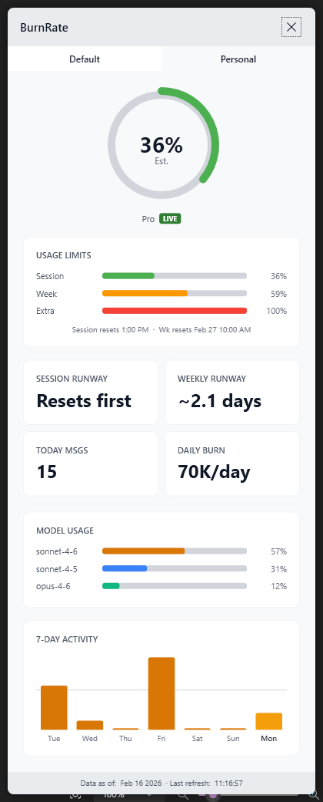
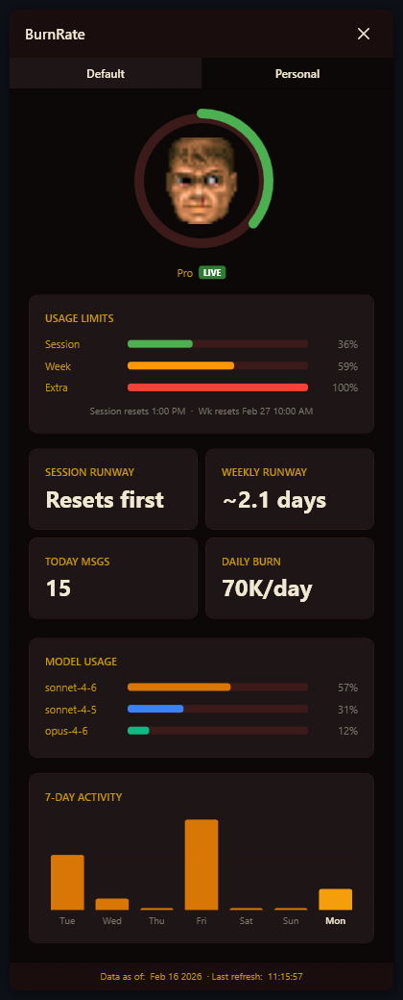

# BurnRate

A Windows system tray application that monitors your [Claude Code](https://docs.anthropic.com/en/docs/claude-code) usage in real time.


## Support This Project

If you find BurnRate useful, consider buying me a coffee!

[](https://buymeacoffee.com/djdd87)

## Screenshots

### System Tray


### Dashboard



### Manage Metrics


## Features

- **System tray icons** — one per Claude profile, showing your current usage percentage with color-coded status (green/amber/red)
- **Live usage data** — pulls real-time 5-hour session and 7-day weekly utilization from the Anthropic API
- **Multi-profile support** — auto-discovers all `~/.claude*` profiles or configure them explicitly
- **Dashboard popup** — click the tray icon to see a circular usage gauge, 7-day activity chart, model token breakdown, and a set of configurable metric cards
- **Configurable metrics** — choose which stats appear on the dashboard via the Manage Metrics menu; available cards include today's messages/tokens/sessions, weekly tokens, daily burn rate, weekly and session runway, estimated cost, time saved, and lifetime totals
- **Near-instant updates** — file system watcher detects changes as they happen, with a poll timer as fallback

## How It Works

BurnRate reads data from three sources:

1. **JSONL conversation files** (`~/.claude*/projects/**/*.jsonl`) — scanned directly for current-day and 7-day stats: messages, output tokens, sessions, and model breakdown
2. **stats-cache.json** — Claude Code's periodic aggregate, used for lifetime totals and cost estimates
3. **Anthropic API** (`/api/oauth/usage`) — the authoritative source for rate-limit utilization percentages and reset times; also used to derive the real weekly token limit for burn rate and runway calculations

The app passively reads your existing Claude Code OAuth token for API access — it never writes credentials or refreshes tokens.

## Requirements

- Windows 10/11
- [.NET 10 SDK](https://dotnet.microsoft.com/download)
- [Claude Code](https://docs.anthropic.com/en/docs/claude-code) installed with at least one `~/.claude*` profile

## Getting Started

```bash
git clone https://github.com/djdd87/BurnRate.git
cd BurnRate
dotnet run --project src/BurnRate/BurnRate.csproj
```

The app will auto-discover your Claude profiles and appear in the system tray.

## Configuration

Edit `src/BurnRate/appsettings.json`:

```json
{
  "BurnRate": {
    "RefreshIntervalSeconds": 60,
    "Profiles": [],
    "PlanLimits": {}
  }
}
```

| Setting | Description |
|---------|-------------|
| `RefreshIntervalSeconds` | How often to poll for changes (default: 60s). File watcher provides faster updates between polls. |
| `Profiles` | Leave empty for auto-discovery, or set explicitly: `[{"Name": "Work", "Path": "C:\\Users\\you\\.claude-work"}]` |
| `PlanLimits` | Optional fallback mapping plan tier IDs to weekly output token limits, used only when the live API is unavailable. Empty by default — the live API provides accurate limits for all known plans. |

## Supported Plans

BurnRate recognises these Claude plan tiers and displays a friendly name in the dashboard and tray tooltip:

| Display name | Tier ID | Subscription type |
|---|---|---|
| Pro | `pro` or `default_claude_ai` | (any) |
| Max 5x | `default_claude_max_5x` | — |
| Max 20x | `default_claude_max_20x` | — |
| Standard | `default_raven` | — |
| Team Pro | `pro` or `default_claude_ai` | `team` |
| Team Premium | `default_claude_max_5x` | `team` |
| Team Premium 20x | `default_claude_max_20x` | `team` |
| Team Standard | `default_raven` | `team` |

Unrecognised tiers are displayed with automatic formatting (underscores replaced, common prefixes stripped).

## Building

```bash
dotnet build src/BurnRate/BurnRate.csproj
```

To publish a self-contained executable:

```bash
dotnet publish src/BurnRate/BurnRate.csproj -c Release -r win-x64 --self-contained
```

## Custom Themes

Themes live in the `CustomThemes/` directory at the repo root. Each theme is a subfolder containing a `theme.json` manifest and optional colour and face-image assets.

```
CustomThemes/
└── MyTheme/
    ├── theme.json
    ├── Colors.xaml        # optional — overrides dashboard colours
    └── faces/             # optional — gauge face images
        ├── face_0.png
        └── ...
```

Themes appear in the **right-click tray menu → Theme** and are selected at runtime with no restart required.

### theme.json

```json
{
  "displayName": "My Theme",
  "colorsDictionary": "Colors.xaml",
  "faceImages": [
    { "upToPercent": 20,  "image": "faces/face_0.png" },
    { "upToPercent": 40,  "image": "faces/face_1.png" },
    { "upToPercent": 60,  "image": "faces/face_2.png" },
    { "upToPercent": 80,  "image": "faces/face_3.png" },
    { "upToPercent": 100, "image": "faces/face_4.png" },
    { "upToPercent": 999, "image": "faces/face_dead.png" }
  ]
}
```

Both `colorsDictionary` and `faceImages` are optional — you can override just the colours, just the gauge faces, or both.

Face images replace the percentage text in the circular gauge. The image whose `upToPercent` is the first value ≥ the current usage percentage is shown.

### Colors.xaml

A standard WPF `ResourceDictionary` that overrides any of the named colour keys used by the dashboard:

| Key | Purpose |
|-----|---------|
| `BgPrimary` / `BgSecondary` | Window and title bar backgrounds |
| `BgCard` / `BgCardHover` | Stat card backgrounds |
| `AccentPrimary` / `AccentSecondary` | Highlights and active indicators |
| `StatusGreen` / `StatusAmber` / `StatusRed` / `StatusGrey` | Usage threshold colours |
| `TextPrimary` / `TextSecondary` / `TextMuted` | Text hierarchy |
| `GaugeTrack` | Gauge ring background |
| `ChartGridLine` | Activity chart grid |

Each colour key must also have a matching `SolidColorBrush` key with the `Brush` suffix (e.g. `BgPrimaryBrush`). See [`CustomThemes/Doom/Colors.xaml`](CustomThemes/Doom/Colors.xaml) for a complete example.

### Doom theme

The built-in Doom theme ships as an example. It replaces the dashboard colours with a dark blood-red palette and swaps the gauge for Doomguy's face, which reacts to your token usage.



## License

[MIT](LICENSE)
